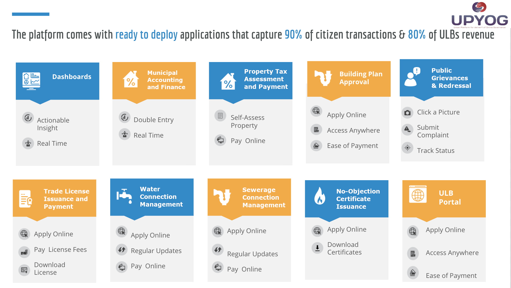
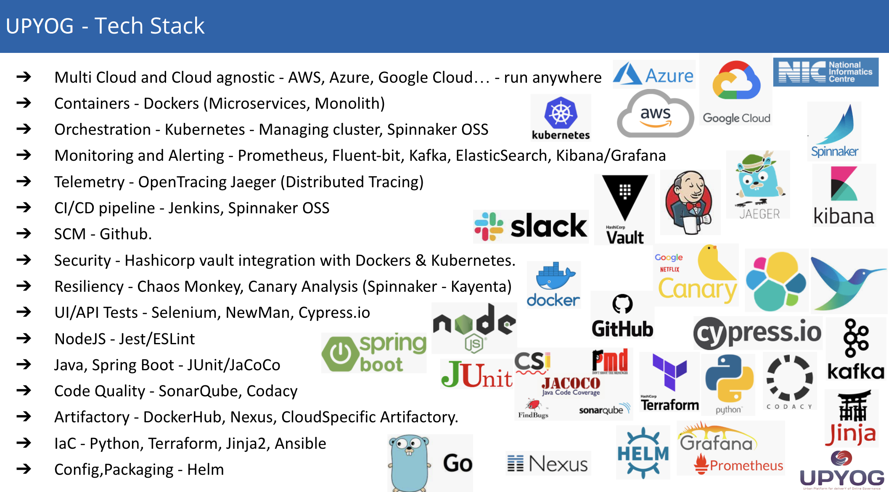
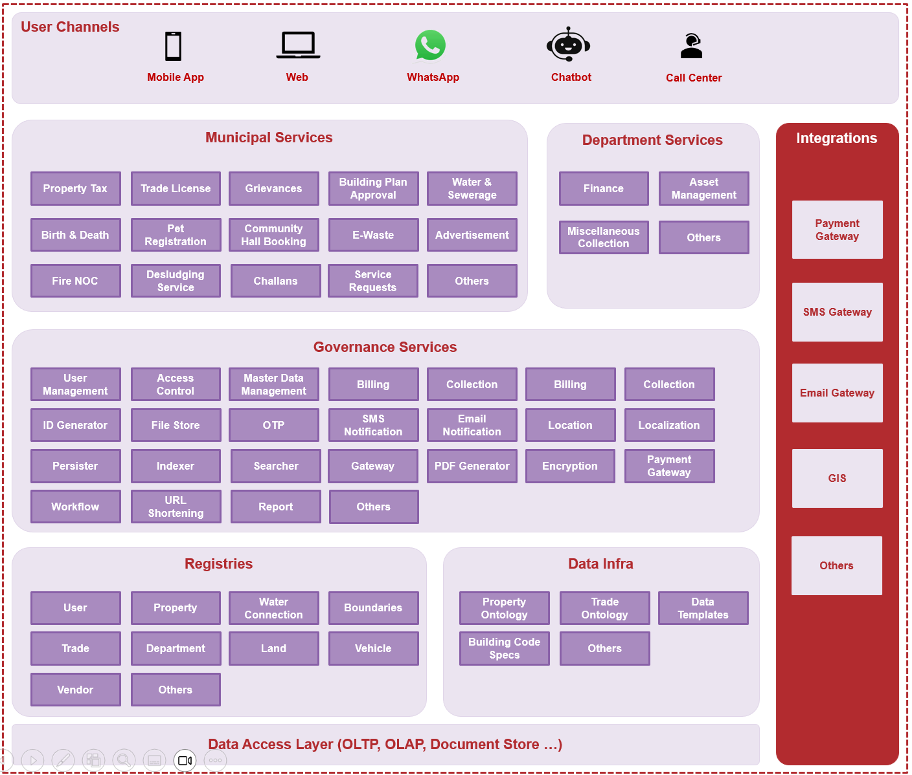
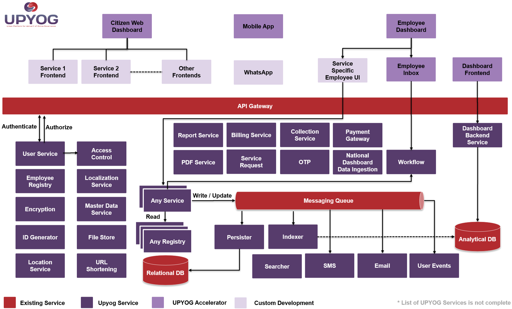

# UPYOG (Urban Platform for deliverY of Online Governance)

  

## Overview

UPYOG (Urban Platform for deliverY of Online Governance) is a comprehensive open-source digital governance platform designed to accelerate the delivery of citizen-centric urban services across India.

UPYOG provides a set of Open APIs, reusable microservices, registries, governance modules, and reference implementations that enable government entities, urban local bodies (ULBs), businesses, startups, and civil society organizations to build and scale digital governance solutions efficiently.

As a public digital good, UPYOG promotes interoperability, openness, innovation, transparency, and inclusion while reducing vendor lock-in and implementation complexity.

---

## Vision

To provide a scalable, secure, and interoperable digital public infrastructure that enables seamless delivery of municipal and governance services to citizens through multiple channels.

---

## Key Principles

- Open Standards and Open APIs
- Mobile-First Design
- Cloud Native Architecture
- Modular and Extensible Platform
- Citizen-Centric Service Delivery
- Interoperability Across Systems
- Scalability and High Availability
- Vendor-Neutral Ecosystem

---

## Useful Links

| Resource | Link |
|-----------|------|
| Documentation | https://upyog-docs.gitbook.io/upyog-v-2.0 |
| Community Discussions | https://github.com/orgs/upyog/discussions |
| Issue Reporting | https://github.com/upyog/UPYOG/issues |
| NIUA | https://niua.in |
| License Terms | https://upyog.niua.org/employee/Upyog%20Code%20and%20Copyright%20License_v1.pdf |

---

# Platform Features

UPYOG offers a wide range of municipal, departmental, and governance services.

  

### Municipal Services

- Property Tax
- Trade License
- Grievances
- Building Plan Approval
- Water & Sewerage
- Birth & Death Registration
- Pet Registration
- Community Hall Booking
- E-Waste Management
- Advertisement Management
- Fire NOC
- Desludging Services
- Challans
- Service Requests

### Department Services

- Finance
- Asset Management
- Miscellaneous Collections
- Department Specific Services

### Governance Services

- User Management
- Access Control
- Master Data Management
- Billing & Collection
- OTP Services
- SMS & Email Notifications
- Localization
- Workflow Engine
- Payment Gateway
- Reporting
- File Store
- Encryption
- PDF Generation

### Registries

- User Registry
- Property Registry
- Trade Registry
- Land Registry
- Water Connection Registry
- Boundary Registry
- Vendor Registry

### Data Infrastructure

- Property Ontology
- Trade Ontology
- Data Templates
- Building Code Specifications

---

# Technical Overview

  

### Technology Characteristics

- Microservices Architecture
- API-First Design
- Event-Driven Communication
- Cloud Native Deployment
- OpenAPI (OAS 2.0) Compliant
- Multi-Tenant Architecture
- Secure Authentication & Authorization
- Scalable Data Infrastructure

---

# Architecture

UPYOG is India's open-source platform for digital governance. Built on OpenAPI (OAS 2.0), it enables state governments and urban local bodies to rapidly deploy digital citizen services while integrating existing systems into a unified governance ecosystem.

The platform can be deployed on:

- Public Cloud
- Private Cloud
- Government Cloud
- Hybrid Infrastructure
- On-Premise Datacenters

---

## Platform Architecture

  

### Architecture Highlights

- Multi-channel citizen access
- Web, Mobile, WhatsApp and Chatbot support
- Service-oriented modular design
- Shared governance infrastructure
- Common registries and master data
- Integrated payment and notification systems
- GIS and third-party integrations

---

## Infrastructure Architecture

  

### Core Components

#### Citizen Channels

- Citizen Web Portal
- Mobile Applications
- WhatsApp Integrations

#### Employee Channels

- Employee Dashboard
- Inbox Management
- Service Workflows

#### Governance Infrastructure

- User Service
- Access Control
- Localization Service
- Master Data Service
- File Store
- Encryption Service
- ID Generator
- URL Shortening

#### Core Service Layer

- Billing Service
- Collection Service
- Report Service
- PDF Service
- OTP Service
- Workflow Engine
- Payment Gateway

#### Data Layer

- Relational Database
- Analytical Database
- Search Engine
- Event Streaming
- Messaging Queue

---

# Deployment

UPYOG supports deployment on:

- Kubernetes
- OpenShift
- Docker
- AWS
- Azure
- GCP
- Government Cloud Infrastructure
- On-Premise Datacenters

---

# Security

UPYOG incorporates security best practices including:

- Role-Based Access Control (RBAC)
- Authentication & Authorization
- Encryption Services
- Audit Logging
- Secure API Gateway
- Data Privacy Controls

---

# Contributing

We welcome contributions from governments, developers, startups, system integrators, and community members.

Please:

1. Fork the repository
2. Create a feature branch
3. Commit your changes
4. Submit a Pull Request

---

# License

UPYOG source code is licensed under:

**UPYOG Code, Copyright and Contribution License Terms**

https://upyog.niua.org/employee/Upyog%20Code%20and%20Copyright%20License_v1.pdf

---

# Developed and Maintained By

**National Institute of Urban Affairs (NIUA)**

https://niua.in

---

  <strong>Building Digital Public Infrastructure for Urban India</strong>

